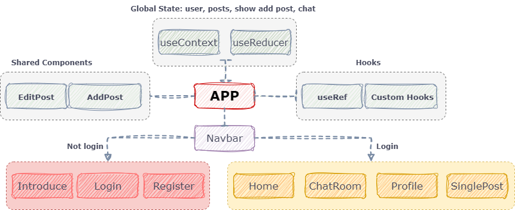

# SocialTree

SocialTree is a social networking website that aims to create a vibrant online community for people to connect, share and engage with each other. The name "SocialTree" reflects the idea that the website is a virtual tree, with each user being a branch that is part of a larger network of interconnected branches.

:link: Website URL: https://social-tree-1d064.web.app/

## Table of Content

- [Front-end Technique](#-front-end-technique)
  - [Tech Stack](#tech-stack)
  - [React](#react)
    - [Component Structure](#component-structure)
  - [React Router](#react-router)
  - [Webpack & Babel](#webpack--babel)
- [Back-end Technique (Firebase Cloud Services)](#-back-end-technique-firebase-cloud-services)
  - [Firebase Authentication](#firebase-authentication)
  - [Cloud Firestore](#cloud-firestore)
  - [Firebase Storage](#firebase-storage)
  - [Firebase Hosting](#firebase-hosting)
- [Main Features](#-main-features)
- [Contact](#contact)

## ✿ Front-end Technique

### Tech Stack

### React

#### Component Structure

### React Router

- version: 6
- Handle the SPA routing.

### Webpack & Babel

- Handle module bundling of the project.
- ES6 JavaScript syntax for browser compatibility.

## ✿ Back-end Technique (Firebase Cloud Services)

### Firebase Authentication

- Register / Login with email and password.

### Firestore

- Store and update user, posts and chatting data

### Firebase Storage

- Host images uploaded from users.

### Firebase Hosting

- Host the static content of the project.

## ✿ Main Features

### Infinite scroll

### Login system

### Create a new post

### Leave a comment

### Chatroom

## Contact

- :blush:Developer: Szu-Ping, Chen
- :mailbox:Email: rainbow801122@gmail.com
